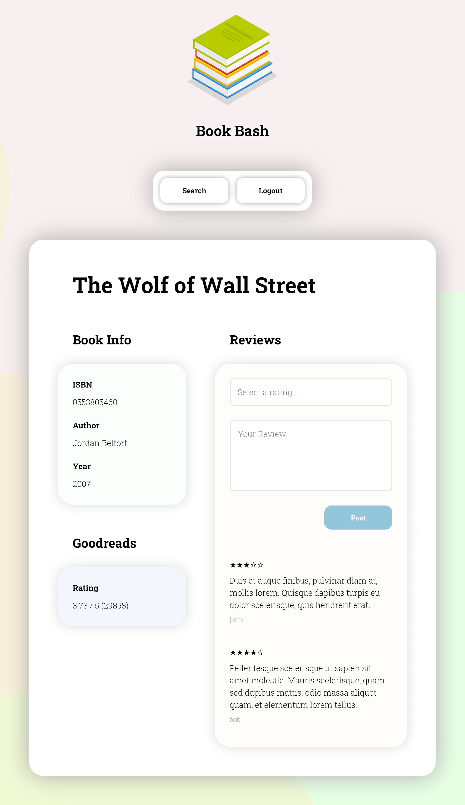

# Book Bash

*Update: Goodreads has recently retired their API which means Book Bash can no longer retrieve their book ratings. Book Bash continues to function normally.*

A book review website where users sign up, search for books, and review them. Using the Goodreads API, it is also possible to view the Goodreads rating for all available books. I created my own API where book details such as average rating, total reviews, and other book details are provided as a JSON response.

*Note: As a challenge, JavaScript was not used.*

Built with Python (Flask), SQL (Relational databases), Jinja, and Goodreads API.

## API

Available at: `/api/<isbn>`

## Books table

Use `import.py` to populate table with `books.csv`.

